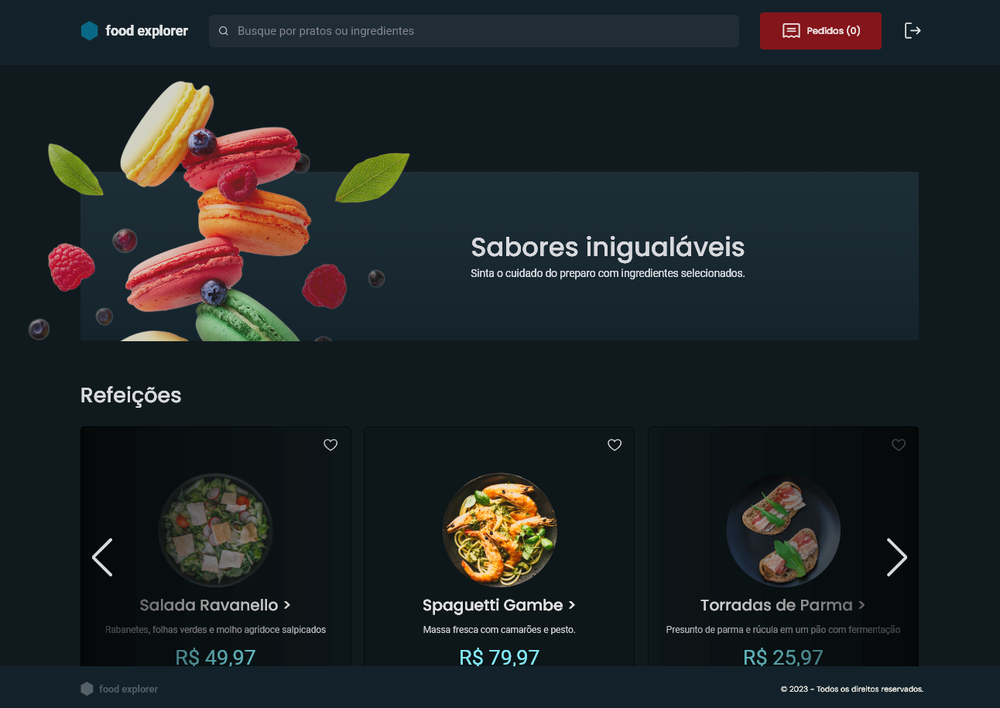

# Food Explorer

Bem-vindo ao README da aplicação Food Exeplorer! Esta é uma aplicação frontend que permite a administração de pratos por um administrador e a visualização/adicionamento de pratos favoritos por usuários comuns.

#### Preview




### Instalação

Para começar, clone o repositório para o seu ambiente local:

```bash
git clone https://github.com/joaovvs/foodexplorer-web.git
cd foodexplorer-web
```
#### Instale as dependências:

```bash

npm install

```

### Configuração
A aplicação requer configurações específicas para se conectar à API Food Explorer. Edite o arquivo src/services/api.js e insira as informações necessárias.

```javascript
export const api = axios.create({
    baseURL: "URL-API-BACK-END", 
    withCredentials: true
});

```

#### Execução

Inicie a aplicação:

```bash
npm start
```

A aplicação estará disponível em http://localhost:5173.

#### Funcionalidades

1. Criação de usuários.
2. Autenticação de usuários.
3. Controle de perfil de usuários. 
3. Cadastro de novos pratos (perfil administrador).
4. Edição de pratos (perfil de administrador).
5. Visualização de pratos (sem restrição de perfil).
6. Pesquisa de pratos por nome ou ingrediente (sem restrição de perfil).
7. Adição de prato aos favoritos (perfil de cliente).
8. Pedidos no Carrinho (A ser desenvolvido posteriormente)
 * Adicionar pratos ao carrinho.
 * Visualizar o carrinho.
 * Realizar pedidos.

### URL da Aplicação

    https://food-exeplorer-9a8739.netlify.app/

### USERS DEMO

| Usuário   | Role       | Pass          |
| :---------- | :--------- | :----------- |
| `joao@gmail.com`      | `admin` | 123456 |
| `teste@teste.com`      | `customer` | 123456 |